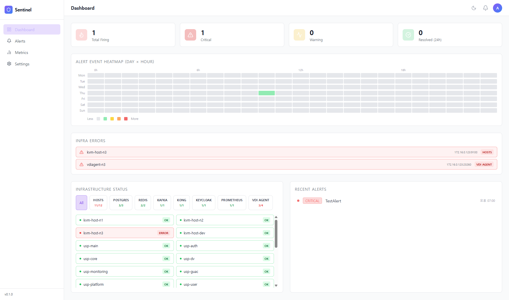

# Sentinel — 인프라 알림 관리 플랫폼

> Prometheus 기반 인프라 알림을 수신·분류·처리하고, 인프라 상태를 실시간으로 모니터링하는 운영 관리 플랫폼입니다.



---

## 📌 목차

- [개요](#개요)
- [주요 기능](#주요-기능)
- [기술 스택](#기술-스택)
- [프로젝트 구조](#프로젝트-구조)
- [시작하기](#시작하기)
  - [사전 요구 사항](#사전-요구-사항)
  - [백엔드 실행](#백엔드-실행)
  - [프론트엔드 실행](#프론트엔드-실행)
  - [Docker 실행](#docker-실행)
- [환경 변수](#환경-변수)
- [API 엔드포인트](#api-엔드포인트)
- [데이터베이스 스키마](#데이터베이스-스키마)

---

## 개요

Sentinel은 **Prometheus Alertmanager**의 Webhook을 수신하여 알림 이벤트를 영속적으로 저장하고, 담당자가 알림을 확인(Acknowledge)·댓글 처리할 수 있도록 지원하는 인프라 운영 플랫폼입니다.

대시보드에서는 알림 발생 현황, 히트맵, 인프라 서비스별 상태를 한눈에 파악할 수 있으며, 이메일 알림(SMTP) 설정도 관리할 수 있습니다.

---

## 주요 기능

| 기능 | 설명 |
|---|---|
| **대시보드** | Total Firing / Critical / Warning / Resolved 통계 카드, 알림 이벤트 히트맵(Day × Hour), 인프라 상태 패널, 최근 알림 목록 |
| **Infra Error 패널** | `up: false` 상태의 서비스 목록을 대시보드 상단에 강조 표시 (서비스명·인스턴스·타입 포함) |
| **알림 목록** | Severity / Status / 기간 필터링, 페이지네이션 지원 |
| **알림 상세** | 알림 확인(Ack) 처리, 코멘트 작성·조회 |
| **메트릭 탐색기** | Prometheus 직접 쿼리 및 차트 시각화 |
| **알림 설정** | SMTP 이메일 수신 조건 및 대상 설정 |
| **Webhook 수신** | Prometheus Alertmanager → Sentinel 실시간 이벤트 저장 |
| **SSE 스트리밍** | 신규 알림 발생 시 브라우저로 실시간 푸시 |

---

## 기술 스택

### Backend

| 항목 | 기술 |
|---|---|
| 언어 | Go 1.24 |
| 웹 프레임워크 | [Echo v4](https://echo.labstack.com/) |
| DB 드라이버 | [pgx/v5](https://github.com/jackc/pgx) + PostgreSQL |
| 마이그레이션 | [golang-migrate v4](https://github.com/golang-migrate/migrate) |
| 인증 | JWT (`golang-jwt`) |
| 외부 연동 | Prometheus HTTP API |
| 알림 발송 | SMTP |
| 컨테이너 | Docker (multi-stage build, Alpine) |

### Frontend

| 항목 | 기술 |
|---|---|
| 언어 | TypeScript 5.9 |
| 프레임워크 | React 19 + Vite 8 |
| 스타일링 | Tailwind CSS 3 |
| 상태 관리 | [Zustand](https://zustand-demo.pmnd.rs/) |
| 서버 상태 | [TanStack Query v5](https://tanstack.com/query) |
| 라우팅 | React Router v7 |
| 차트 | [Recharts](https://recharts.org/) |
| HTTP 클라이언트 | Axios |
| 아이콘 | Lucide React |

---

## 프로젝트 구조

```
Sentinel/
├── backend/                    # Go 백엔드
│   ├── cmd/server/             # 엔트리포인트
│   ├── internal/
│   │   ├── config/             # 환경 설정
│   │   ├── db/                 # DB 연결
│   │   ├── handler/            # HTTP 핸들러 (alert, dashboard, metrics, notification, stream, webhook)
│   │   ├── model/              # 도메인 모델
│   │   ├── repository/         # DB 쿼리 계층
│   │   └── service/            # 비즈니스 로직
│   ├── migrations/             # SQL 마이그레이션 파일
│   ├── Dockerfile
│   └── .env.example
│
├── frontend/                   # React 프론트엔드
│   ├── src/
│   │   ├── api/                # Axios API 클라이언트
│   │   ├── components/         # 공통 컴포넌트 (InfraErrorPanel 등)
│   │   ├── hooks/              # 커스텀 훅
│   │   ├── pages/              # 페이지 컴포넌트
│   │   │   ├── Dashboard.tsx
│   │   │   ├── AlertList.tsx
│   │   │   ├── AlertDetail.tsx
│   │   │   ├── MetricsExplorer.tsx
│   │   │   └── NotificationSettings.tsx
│   │   ├── store/              # Zustand 스토어
│   │   └── types/              # TypeScript 타입 정의
│   └── package.json
│
├── openspec/                   # OpenSpec 변경 이력 및 사양
│   ├── specs/
│   └── changes/
│
└── public/
    └── images/
        └── Sentinel.png
```

---

## 시작하기

### 사전 요구 사항

- **Go** 1.24 이상
- **Node.js** 20 이상 + npm
- **PostgreSQL** 14 이상
- **Prometheus** (인프라 메트릭 수집용, 선택)

---

### 백엔드 실행

```bash
# 1. 디렉토리 이동
cd backend

# 2. 환경 변수 설정
cp .env.example .env
# .env 파일을 열어 DB 접속 정보 등을 수정

# 3. 의존성 설치
go mod download

# 4. 서버 실행 (DB 마이그레이션 자동 적용)
go run ./cmd/server
```

서버는 기본적으로 `http://localhost:8080` 에서 실행됩니다.

---

### 프론트엔드 실행

```bash
# 1. 디렉토리 이동
cd frontend

# 2. 의존성 설치
npm install

# 3. 개발 서버 실행
npm run dev
```